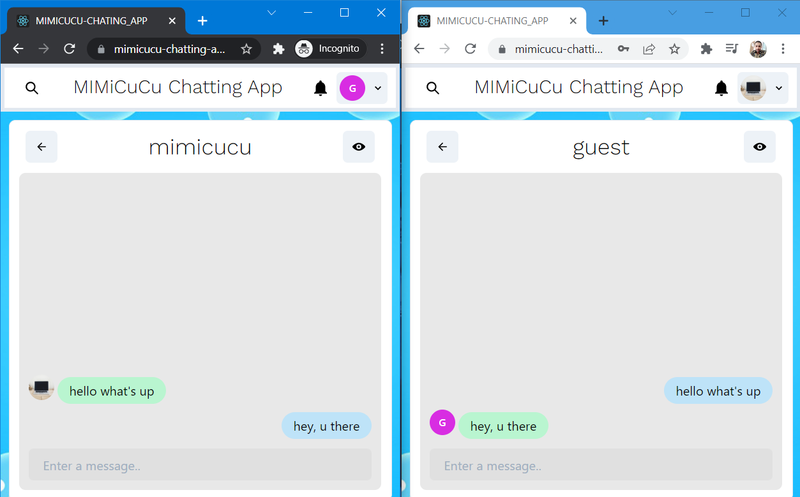

# MIMICUCU CHATTING APP (MERN)

A MERN stack chatting app using React framework,
Chukra UI library and Socket.IO.

### THE CHAT BOX

### THE LOGIN FORM

### THE SIGNUP FORM

# LIVE LINK (HEROKU)

[MiMiCuCu-Chatting-App](https://mimicucu-chatting-app.herokuapp.com/ "it is live")
